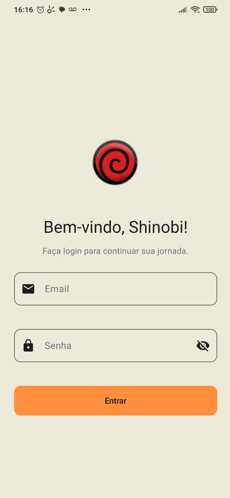
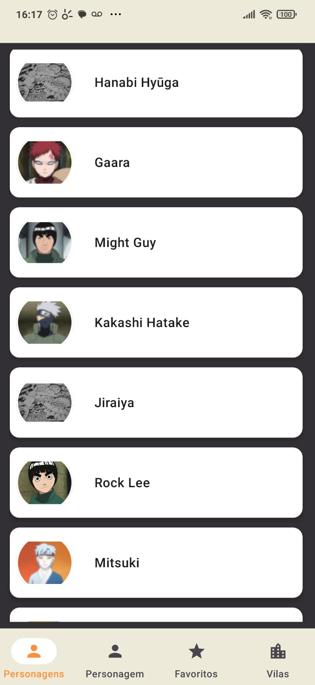
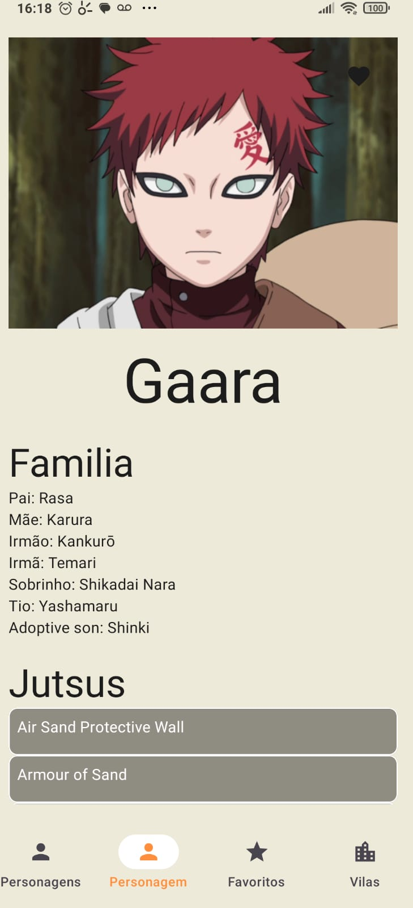
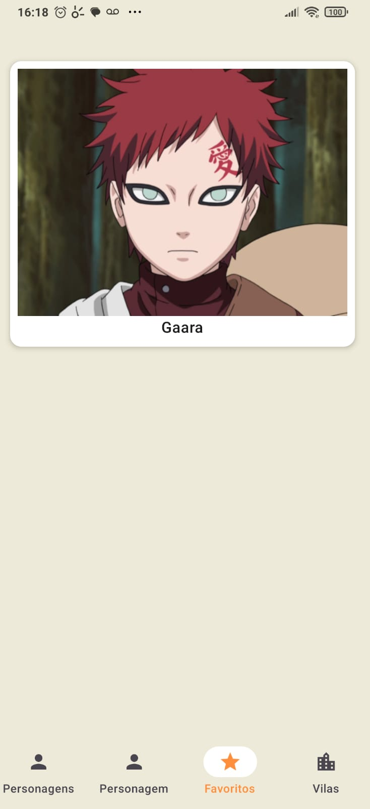
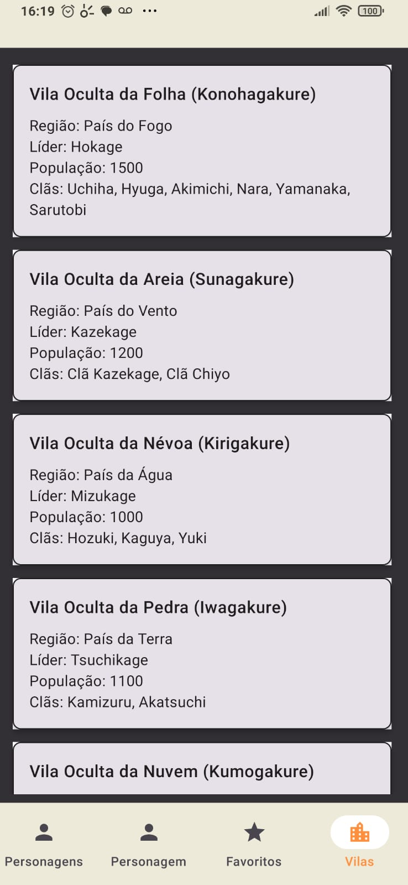

# NarutoApp

## 👥 Integrantes da equipe
- Eliel
- Jadeilson
---

### Documentação do Projeto
## 📋 Visão Geral
Projeto Android desenvolvido em Kotlin utilizando Jetpack Compose para construção de interfaces modernas e reativas.
## 🛠️ Tecnologias e Versões
# Linguagens
- Kotlin: Linguagem principal do projeto
- Java: Suporte para bibliotecas legadas
- Gradle: Sistema de build e gerenciamento de dependências
# Bibliotecas Principais
Jetpack Compose
- Compose UI: Framework moderno para construção de interfaces declarativas
- Material Design 3: Componentes de UI seguindo diretrizes do Material Design
# Arquitetura
MVVM (Model-View-ViewModel)
- ViewModel: Gerenciamento de estado e lógica de negócio
- Lifecycle: Componentes conscientes do ciclo de vida
- ViewModelProvider.Factory: Padrão para injeção de dependências no ViewModel

# Navegação
- Compose Navigation: Sistema de navegação entre telas composables
## 🏗️ Padrões Arquiteturais Aplicados
MVVM (Model-View-ViewModel)
- Model: Representação dos dados (ex: Character)
- View: Composables como CharacterScreen
- ViewModel: CharacterViewModel gerencia estado e lógica
# Repository Pattern
- CharacterRepository: Camada de abstração para acesso aos dados
Separa a fonte de dados da lógica de negócio
# Factory Pattern
- CharacterViewModelFactory: Criação controlada de instâncias do ViewModel
Permite injeção de dependências de forma estruturada
Single Responsibility Principle
Cada classe tem uma responsabilidade única e bem definida
## 📱 Funcionalidades Implementadas
Tela de Personagens (CharacterScreen)
- Exibição de Lista: Apresentação de personagens em formato de lista
- Navegação: Callback onPersonagemClick para navegação ao detalhe
- Gerenciamento de Estado: Integração com CharacterViewModel
- Injeção de Dependências: ViewModel injetado via parâmetro com valor padrão
## ViewModel (CharacterViewModel)
- Gerenciamento do estado da tela de personagens
- Comunicação com o repositório de dados
- Exposição de dados observáveis para a UI
## 🔧 Configuração do Projeto
Build System
- Gradle: Automatização de build e gerenciamento de dependências
- Configuração modular e escalável

# Estrutura

```shell
│   MainActivity.kt
├───data
│   ├───dao
│   │       CharactersDao.kt
│   ├───db
│   │       AppDatabase.kt
│   └───entity
│           CharacterMapper.kt
│           CharactersEntity.kt
├───models
│       Character.kt
│       Debut.kt
│       Father.kt
│       Image.kt
│       Jutsu.kt
│       LoginRequest.kt
│       LoginResponse.kt
│       LoginUiState.kt
│       Mother.kt
│       Personal.kt
│       Village.kt
├───navigation
│       BottomBar.kt
│       NavGraph.kt
│       Routes.kt
├───repository
│   ├───auth
│   │       AuthRepository.kt
│   │       AuthRepositoryImpl.kt
│   ├───character
│   │       CharacterRepositoryImpl.kt
│   │       ICharacterRepository.kt
│   └───village
│           IVillageRepository.kt
│           VillageRepositoryImpl.kt
├───services
│       ClientRetrofit.kt
│       IClient.kt
│       INarutoApi.kt
├───ui
│   ├───character
│   │       CharacterScreen.kt
│   │       CharacterViewModel.kt
│   │       CharacterViewModelFactory.kt
│   ├───characterDetails
│   │       CharacterDetailsScreen.kt
│   │       CharacterDetailsViewModel.kt
│   │       CharacterDetailsViewModelFactory.kt
│   ├───favorite
│   │       FavoriteScreen.kt
│   │       FavoriteViewModel.kt
│   │       FavoriteViewModelFactory.kt
│   │
│   ├───login
│   │       LoginScreen.kt
│   │       LoginViewModel.kt
│   ├───theme
│   │       Color.kt
│   │       Theme.kt
│   │       Type.kt
│   └───village
│           VillageScreen.kt
│           VillageViewModel.kt
│           VillageViewModelFactory.kt
└───utils
        Converts.kt
        UiState.kt

```

## 💻 Instruções de Instalação e Execução

1. Clone o repositório:  
```bash
git clone https://github.com/seu-usuario/NarutoApp.git
```

2. Abra o projeto no Android Studio.

3. Sincronize o Gradle:

```File > Sync Project with Gradle Files```

4. Execute o app:

5. Selecione o dispositivo/emulador

6. Clique em "Run"

Para testar a persistência e API:

Certifique-se de ter conexão com a internet (para dados da API)


# Prints do App

## Tela de Login



## Tela de personagens



## Tela de personagem



## Tela de favoritos



## Tela de vilas




Documentação gerada em: ```sh
date +"%d/%m/%Y %T"
```
